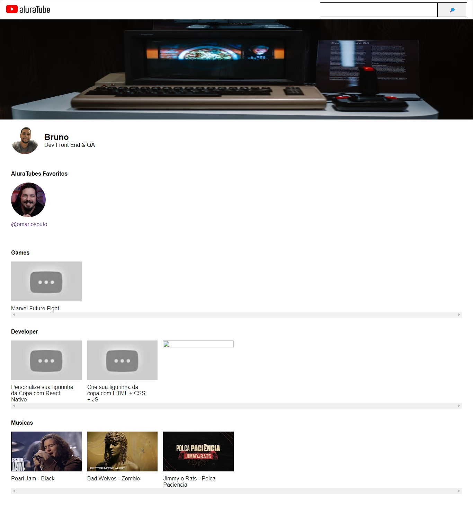

<h1 align="center">
  AluraTube | Imersão React
</h1>

  <a href="https://alura-imersao-react-bh-tec.vercel.app/">🔗 Live Preview</a>&nbsp;&nbsp;&nbsp;|&nbsp;&nbsp;&nbsp;
  <a href="#-projeto">🖥️ Projeto</a>&nbsp;&nbsp;&nbsp;|&nbsp;&nbsp;&nbsp;
  <a href="#-tecnologias">🚀 Tecnologias</a>&nbsp;&nbsp;&nbsp;|&nbsp;&nbsp;&nbsp;
  <a href="#-license">📝 License</a>

  

## 💻 Projeto

Projeto da Imersão React v5 da Alura, criando uma página mirror do YouTube com o React. O objetivo é praticar o uso do React.

## 🚀 Tecnologias

  
  
  
  

## 📝 License

Esse projeto está sob a licença MIT. Veja o arquivo [LICENSE](.github/LICENSE.md) para mais detalhes.

---
